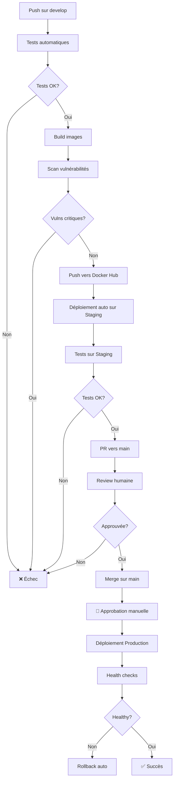

# Sécurité du Déploiement Continu (CD)

## ⚠️ Question : Est-il vraiment sûr de déployer automatiquement chaque nouvelle image sur le hub ?

### Réponse courte : **NON, ce n'est PAS sûr sans précautions appropriées.**

---

## 🔴 Risques du déploiement automatique non sécurisé

### 1. **Déploiement de code non testé ou défectueux**
- ❌ Une erreur dans le code peut casser la production
- ❌ Les bugs passent directement en production
- ❌ Pas de vérification humaine avant déploiement

### 2. **Vulnérabilités de sécurité**
- ❌ Déploiement automatique de dépendances vulnérables
- ❌ Injection de code malveillant si le repo est compromis
- ❌ Secrets exposés accidentellement dans les images

### 3. **Problèmes de disponibilité**
- ❌ Déploiement pendant les heures de pointe
- ❌ Pas de rollback automatique en cas d'échec
- ❌ Downtime non planifié

### 4. **Compromission du compte Docker Hub**
- ❌ Si le compte Docker Hub est hacké, des images malveillantes peuvent être déployées
- ❌ Pas de vérification de l'intégrité des images

### 5. **Manque de contrôle**
- ❌ Tout développeur peut déclencher un déploiement en production
- ❌ Pas de processus d'approbation
- ❌ Difficulté à tracer qui a déployé quoi

---

## ✅ Solutions pour sécuriser le déploiement automatique

### 🛡️ 1. **Stratégie de branches et environnements**

**Implémentation actuelle dans notre workflow :**
```yaml
if: github.ref == 'refs/heads/main' && github.event_name == 'push'
```

**Améliorations possibles :**
```yaml
# Déployer sur différents environnements selon la branche
jobs:
  deploy-to-staging:
    if: github.ref == 'refs/heads/develop'
    # Déploiement automatique sur staging
    
  deploy-to-production:
    if: github.ref == 'refs/heads/main'
    # Déploiement en production avec approbation manuelle
    environment:
      name: production
      url: http://abdellah.sofi1.takima.cloud
```

**Avantages :**
- ✅ Séparation claire entre staging et production
- ✅ Tests en staging avant production
- ✅ Réduction des risques

---

### 🧪 2. **Tests obligatoires avant déploiement**

**Implémentation actuelle :**
```yaml
deploy-to-production:
  needs: build-and-push-docker-image  # Attend que les tests passent
```

**Tests recommandés :**
- ✅ Tests unitaires (déjà implémenté avec Maven)
- ✅ Tests d'intégration (déjà implémenté)
- ✅ Analyse de code statique (SonarCloud déjà configuré)
- ⚠️ À ajouter : Tests de sécurité des dépendances
- ⚠️ À ajouter : Scan de vulnérabilités des images Docker

**Amélioration - Scanner les images Docker :**
```yaml
- name: Scan Docker image for vulnerabilities
  uses: aquasecurity/trivy-action@master
  with:
    image-ref: '${{ env.DOCKER_USERNAME }}/tp-devops-simple-api-backend:latest'
    format: 'sarif'
    output: 'trivy-results.sarif'
    severity: 'CRITICAL,HIGH'
    exit-code: '1'  # Échouer si vulnérabilités critiques
```

---

### 🔐 3. **Approbation manuelle (Protection Branch)**

**GitHub Environments avec approbation :**
```yaml
deploy-to-production:
  environment:
    name: production
    url: http://abdellah.sofi1.takima.cloud
  # Nécessite une approbation manuelle avant déploiement
```

**Configuration dans GitHub :**
1. Settings → Environments → New environment "production"
2. Cocher "Required reviewers"
3. Ajouter les reviewers autorisés (vous, votre équipe)
4. Optionnel : Ajouter un délai (wait timer)

**Avantages :**
- ✅ Contrôle humain avant déploiement
- ✅ Traçabilité (qui a approuvé)
- ✅ Fenêtre de déploiement contrôlée

---

### 🏷️ 4. **Utiliser des tags de version au lieu de `latest`**

**Problème actuel :**
```yaml
tags: ${{ env.DOCKER_USERNAME }}/tp-devops-simple-api-backend:latest
```

**Solution recommandée :**
```yaml
- name: Build image and push backend
  uses: docker/build-push-action@v6
  with:
    context: ./backend
    push: true
    tags: |
      ${{ env.DOCKER_USERNAME }}/tp-devops-simple-api-backend:latest
      ${{ env.DOCKER_USERNAME }}/tp-devops-simple-api-backend:${{ github.sha }}
      ${{ env.DOCKER_USERNAME }}/tp-devops-simple-api-backend:v${{ github.run_number }}
```

**Avantages :**
- ✅ Traçabilité : savoir exactement quelle version est déployée
- ✅ Rollback facile vers une version spécifique
- ✅ Audit et historique des déploiements
- ✅ Pas de confusion sur "latest"

---

### 🔒 5. **Sécurisation des secrets GitHub**

**Secrets nécessaires pour le déploiement :**
```bash
# Secrets à configurer dans GitHub (Settings → Secrets and variables → Actions)
SSH_PRIVATE_KEY      # Clé SSH pour se connecter au serveur
SERVER_HOST          # abdellah.sofi1.takima.cloud
SERVER_USER          # admin
DOCKERHUB_USERNAME   # abdou775
SECRET_TOKEN         # Token Docker Hub
```

**Bonnes pratiques :**
- ✅ Ne JAMAIS commit les clés en clair
- ✅ Utiliser des clés SSH dédiées au déploiement (pas votre clé personnelle)
- ✅ Rotation régulière des secrets
- ✅ Limiter les permissions des secrets au minimum nécessaire
- ✅ Utiliser des tokens Docker Hub avec permissions limitées (lecture/écriture seulement sur vos repos)

**Amélioration - Utiliser un token Docker Hub avec permissions limitées :**
1. Aller sur Docker Hub → Account Settings → Security → New Access Token
2. Créer un token avec permissions "Read, Write, Delete" seulement sur vos repos
3. Utiliser ce token au lieu de votre mot de passe principal

---

### 🔄 6. **Stratégie de rollback automatique**

**Ajouter un rollback en cas d'échec :**
```yaml
- name: Health check
  id: health_check
  run: |
    sleep 30
    curl -f http://${{ secrets.SERVER_HOST }}:8080/actuator/health || exit 1

- name: Rollback on failure
  if: failure() && steps.health_check.outcome == 'failure'
  run: |
    echo "🔙 Rollback vers la version précédente..."
    ssh -i ~/.ssh/deploy_key ${{ secrets.SERVER_USER }}@${{ secrets.SERVER_HOST }} \
      'docker pull ${{ env.DOCKER_USERNAME }}/tp-devops-simple-api-backend:previous && \
       docker stop backend && \
       docker rm backend && \
       docker run -d --name backend --network app-network \
         ${{ env.DOCKER_USERNAME }}/tp-devops-simple-api-backend:previous'
```

**Stratégies de déploiement avancées :**
- **Blue-Green Deployment** : Déployer sur un nouvel environnement, basculer si OK
- **Canary Deployment** : Déployer progressivement (10%, 50%, 100%)
- **Rolling Update** : Remplacer progressivement les conteneurs

---

### 📊 7. **Monitoring et alertes**

**Ajouter du monitoring post-déploiement :**
```yaml
- name: Post-deployment monitoring
  run: |
    echo "📊 Monitoring post-déploiement..."
    # Vérifier les endpoints critiques
    curl -f http://${{ secrets.SERVER_HOST }}/api/departments
    curl -f http://${{ secrets.SERVER_HOST }}/api/students
    # Vérifier les logs
    ssh -i ~/.ssh/deploy_key ${{ secrets.SERVER_USER }}@${{ secrets.SERVER_HOST }} \
      'docker logs backend --tail 50 | grep -i error && exit 1 || exit 0'
```

**Outils recommandés :**
- **Prometheus + Grafana** : Monitoring des métriques
- **ELK Stack** : Centralisation des logs
- **Sentry** : Tracking des erreurs en production
- **UptimeRobot** : Monitoring de disponibilité

---

### 🔍 8. **Scan de vulnérabilités des images**

**Ajouter Trivy pour scanner les images :**
```yaml
- name: Scan database image
  uses: aquasecurity/trivy-action@master
  with:
    image-ref: '${{ env.DOCKER_USERNAME }}/tp-devops-simple-api-database:latest'
    severity: 'CRITICAL,HIGH'
    exit-code: '1'

- name: Scan backend image
  uses: aquasecurity/trivy-action@master
  with:
    image-ref: '${{ env.DOCKER_USERNAME }}/tp-devops-simple-api-backend:latest'
    severity: 'CRITICAL,HIGH'
    exit-code: '1'

- name: Scan httpd image
  uses: aquasecurity/trivy-action@master
  with:
    image-ref: '${{ env.DOCKER_USERNAME }}/tp-devops-simple-api-httpd:latest'
    severity: 'CRITICAL,HIGH'
    exit-code: '1'
```

**Avantages :**
- ✅ Détection des CVEs dans les images
- ✅ Blocage du déploiement si vulnérabilités critiques
- ✅ Conformité aux standards de sécurité

---

### 🔐 9. **Signature et vérification des images Docker**

**Utiliser Docker Content Trust (DCT) :**
```yaml
- name: Sign Docker image
  env:
    DOCKER_CONTENT_TRUST: 1
    DOCKER_CONTENT_TRUST_REPOSITORY_PASSPHRASE: ${{ secrets.DCT_PASSPHRASE }}
  run: |
    docker trust sign ${{ env.DOCKER_USERNAME }}/tp-devops-simple-api-backend:latest
```

**Avantages :**
- ✅ Garantie de l'intégrité des images
- ✅ Vérification que l'image vient bien de vous
- ✅ Protection contre les images falsifiées

---

### 📝 10. **Audit et traçabilité**

**Ajouter des notifications et logs :**
```yaml
- name: Notify deployment
  if: always()
  uses: 8398a7/action-slack@v3
  with:
    status: ${{ job.status }}
    text: |
      Déploiement en production
      Commit: ${{ github.sha }}
      Auteur: ${{ github.actor }}
      Status: ${{ job.status }}
    webhook_url: ${{ secrets.SLACK_WEBHOOK }}
```

**Traçabilité recommandée :**
- ✅ Logs de tous les déploiements
- ✅ Qui a déclenché le déploiement
- ✅ Quelle version a été déployée
- ✅ Résultat (succès/échec)
- ✅ Durée du déploiement

---

## 🎯 Configuration recommandée complète

### Résumé des secrets GitHub à configurer :

```bash
# Secrets à ajouter dans Settings → Secrets and variables → Actions

# 1. Secrets Docker Hub
DOCKERHUB_USERNAME=abdou775
SECRET_TOKEN=<votre_token_docker_hub>

# 2. Secrets SSH pour déploiement
SSH_PRIVATE_KEY=<contenu_de_votre_cle_ssh_privee>
SERVER_HOST=abdellah.sofi1.takima.cloud
SERVER_USER=admin

# 3. (Optionnel) Secrets pour notifications
SLACK_WEBHOOK=<votre_webhook_slack>

# 4. (Optionnel) Secrets pour SonarCloud
SONAR_TOKEN=<votre_token_sonar>
```

### Comment ajouter les secrets :

1. Aller sur GitHub → Votre repo → Settings
2. Dans la sidebar : "Secrets and variables" → "Actions"
3. Cliquer "New repository secret"
4. Ajouter chaque secret avec son nom et sa valeur

---

## 📋 Checklist de sécurité du déploiement continu

### ✅ Déjà implémenté dans votre projet :
- ✅ Tests automatiques avant déploiement (Maven, tests d'intégration)
- ✅ Analyse de code avec SonarCloud
- ✅ Déploiement uniquement sur la branche `main`
- ✅ Build des images Docker pour AMD64
- ✅ Vérification post-déploiement (health check)
- ✅ Nettoyage des secrets SSH après usage

### ⚠️ À améliorer :
- ⚠️ Ajouter une approbation manuelle pour production (GitHub Environments)
- ⚠️ Utiliser des tags de version au lieu de `latest` uniquement
- ⚠️ Ajouter un scan de vulnérabilités des images (Trivy)
- ⚠️ Implémenter une stratégie de rollback automatique
- ⚠️ Ajouter du monitoring post-déploiement
- ⚠️ Séparer staging et production
- ⚠️ Ajouter des notifications (Slack, email)
- ⚠️ Implémenter la signature des images Docker

---

## 🚦 Workflow recommandé pour la production



---

## 📚 Ressources et documentation

### Documentation officielle :
- [GitHub Actions Security Best Practices](https://docs.github.com/en/actions/security-guides/security-hardening-for-github-actions)
- [Docker Security Best Practices](https://docs.docker.com/engine/security/)
- [Ansible Security](https://docs.ansible.com/ansible/latest/user_guide/playbooks_best_practices.html#best-practices-for-variables-and-vaults)

### Outils de sécurité :
- [Trivy](https://github.com/aquasecurity/trivy) - Scanner de vulnérabilités
- [Snyk](https://snyk.io/) - Sécurité des dépendances
- [Hadolint](https://github.com/hadolint/hadolint) - Linter pour Dockerfiles
- [Docker Bench](https://github.com/docker/docker-bench-security) - Audit de sécurité Docker

---

## ✅ Conclusion

**Le déploiement automatique est puissant mais dangereux sans précautions.**

### Recommandations prioritaires :

1. **🔴 CRITIQUE** : Ajouter une approbation manuelle pour la production
2. **🟠 IMPORTANT** : Scanner les images pour les vulnérabilités
3. **🟡 RECOMMANDÉ** : Utiliser des tags de version
4. **🟢 BONUS** : Implémenter le monitoring et les alertes

**Avec ces mesures, le déploiement automatique devient :**
- ✅ Plus sûr
- ✅ Plus contrôlé
- ✅ Plus traçable
- ✅ Plus fiable

---

**Date de création :** 27 octobre 2025  
**Version :** 1.0  
**Auteur :** Documentation de sécurité CD pour le projet tp-devops

